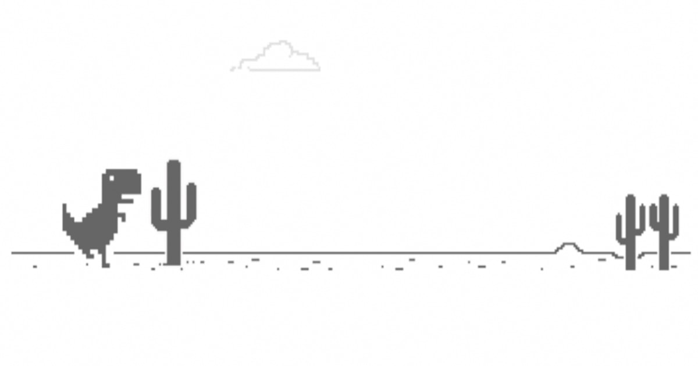

#### QtDinoJump mimics the Chrome dinosaur game.

#### File Structure.	
	.
	├── README.md
	├── MediaResources.qrc
	├── media
	│   └── icons
	│	   ├── Screenshot from 2022-09-21 10-20-58.png
	│	   ├── dino_RightFootUp.png
	│	   ├── dino.png
	│	   ├── dino_LeftFootUp.png
	│	   ├── dino.bmp
	│	   └── cactus.png
	├── Makefile
	├── mainwindow.ui
	├── mainwindow.h
	├── mainwindow.cpp
	├── main.cpp
	├── dinosaur.h
	├── dinosaur.cpp
	├── CMakeLists.txt.user
	├── CMakeLists.txt
	├── cmake_install.cmake
	├── CMakeFiles
	│   ├── TargetDirectories.txt
	│   ├── QtDinoJump.dir
	│   │   ├── QtDinoJump_autogen
	│   │   │   └── EWIEGA46WW
	│   │   ├── progress.make
	│   │   ├── link.txt
	│   │   ├── flags.make
	│   │   ├── depend.make
	│   │   ├── DependInfo.cmake
	│   │   ├── compiler_depend.ts
	│   │   ├── compiler_depend.make
	│   │   ├── compiler_depend.internal
	│   │   ├── cmake_clean.cmake
	│   │   └── build.make
	│   ├── QtDinoJump_autogen.dir
	│   │   ├── progress.make
	│   │   ├── DependInfo.cmake
	│   │   ├── compiler_depend.ts
	│   │   ├── compiler_depend.make
	│   │   ├── cmake_clean.cmake
	│   │   ├── build.make
	│   │   ├── AutoRcc_MediaResources_EWIEGA46WW_Used.txt
	│   │   ├── AutoRcc_MediaResources_EWIEGA46WW_Lock.lock
	│   │   ├── AutoRcc_MediaResources_EWIEGA46WW_Info.json
	│   │   └── AutogenInfo.json
	│   ├── progress.marks
	│   ├── Makefile.cmake
	│   ├── Makefile2
	│   ├── CMakeTmp
	│   ├── CMakeRuleHashes.txt
	│   ├── CMakeOutput.log
	│   ├── CMakeDirectoryInformation.cmake
	│   ├── cmake.check_cache
	│   └── 3.22.1
	│	   ├── CompilerIdCXX
	│	   │   ├── tmp
	│	   │   ├── CMakeCXXCompilerId.cpp
	│	   │   └── a.out
	│	   ├── CMakeSystem.cmake
	│	   ├── CMakeDetermineCompilerABI_CXX.bin
	│	   └── CMakeCXXCompiler.cmake
	├── CMakeCache.txt
	├── cactus.h
	└── cactus.cpp
